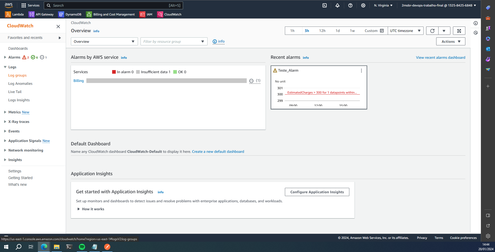
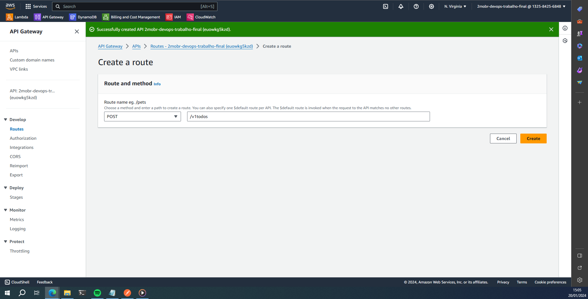
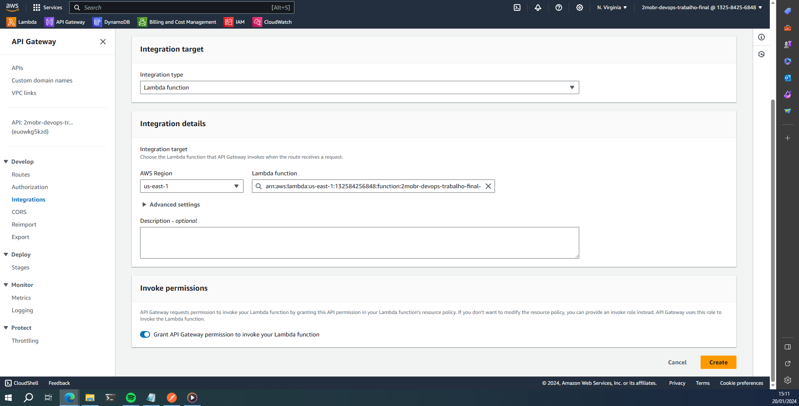
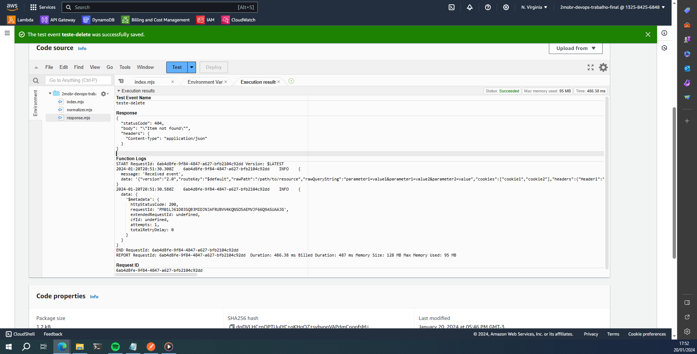

# Desenvolvimento de uma aplicação Serverless na AWS

## Arquitetura da aplicação


- Serviços utilizados da AWS:
1. API Gateway
2. Lambda
3. DynamoDB

- Criação de um CRUD simples.
1. Listar um único registro
2. Listar todos os registros
3. Criar registro
4. Editar registro
5. Excluir registro

## 1) Criação do usuário

Como eu já tenho uma conta na AWS, irei criar um usuário no IAM para a realização do trabalho.

- Acessar o painel do IAM e clicar em **Users**.


- Clicar em Create **User**.


- Colocar um nome, dar acesso ao AWS Management Console, pois irei desenvolver o trabalho no console, e, por facilidade, escolher a opção **I want to create an IAM user**.

- Irá aparecer opções de gerar a senha do usuário automaticamente, ou criar uma nova senha, com a opção do usuário criar uma nova senha no próximo login. 

- Como serei eu que irei usar esse usuário, desabilitei essa opção de criar nova senha no próximo login. Clicar em **Next** para prosseguir com a criação do usuário.


- Para as permissões, por facilidade, dei acesso de administrador (**AdministratorAccess**) para o usuário. Clicar em **Next**.


- Revisar as opções escolhidas, e criar uma tag, se necessário. Se estiver tudo certo, clicar em **Create User**.


- Aparecerá essa tela para pegar as informações da url de login, o nome do usuário e a senha gerada pela AWS. Pode copiar essas informações e salvar em um documento, ou clicar em **Download .csv file** para baixar as informações em um arquivo .csv. Essa tela só aparecerá dessa vez.


- Acessar o link de login (nesse caso, https://132584256848.signin.aws.amazon.com/console), e colocar o IAM user name e a senha definidas anteriormente. No momento em que acessar esse link, o console do root será deslogado.


- Com isso, podemos começar a criar os serviços a partir deste usuário.


## 2) Criação do banco de dados no DynamoDB

- Para criar o banco de dados no DynamoDB, basta procurar por DynamoDB na busca e clicar no serviço.


- Clicar em **Create table**.


- Em **Table name**, colocar o nome da tabela (*todos*) e, em **Partition Key**, colocar o nome *id* e o tipo da variável como *Number*. Deixar as outras opções como está e clicar em **Create table**.


- Esperar até a tabela ser criada com sucesso.


## 3) Criação e teste das funções de criação de dados no Lambda

- Para acessar o serviço do Lambda, basta procurar por Lambda na barra de busca e clicar no serviço.


A primeira função a ser criada será o método POST do CRUD.
- Clicar em **Create function**.
- Escolher a opção Author from scratch, que irá criar um exemplo de Hello World. 
- Em **Function name**, colocar o nome da função (2mobr-devops-trabalho-final-post) 
- Escolher a **Runtime** da Lambda. No momento de criação deste trabalho, a runtime do Node.js 14.x não está mais disponível (que foi usada e recomendada no momento da gravação da aula). Por conta disso, vou escolher o Node.js 20.x.
- Deixar as outras opções sem alteração e clicar em **Create function**.


- Vamos criar duas variáveis de ambiente. A primeira é o **DEBUG**, que, caso o valor dela seja verdadeiro, serve para dar um print de informações no console, e também guardar um log dessas informações no CloudWatch. e a segunda variável é o **TABLE**, que será o nome da tabela do DynamoDB, (todos).
- Clicar na aba **Configuration** e, no lado esquerdo, clicar em **Environment variables**. Em seguida, clicar em **Edit** para adicionar as variáveis.


- Clicar em **Add environment variable** e, nos campos que apareceram, colocar em **Key** o valor **DEBUG**, e o **Value** com o valor **true**. Clicar novamente em **Add environment variable** e, em **Key**, colocar **TABLE**, e em **Value**, colocar todos. Clicar em **Save**.


- Voltando para a aba **Code**, vamos criar dois arquivos. O primeiro é o **normalizer.mjs**, que irá filtrar as informações recebidas do API Gateway na variável *event*, e devolver para o handler o método, o corpo da requisição, a querystring e os path parameters. Para criar o arquivo, clicar com o botão direito no mouse na pasta e clicar em **New File**, e nomear esse novo arquivo como normalizer.mjs.


- Colocar o código fonte abaixo e clicar em **Deploy** para salvar o arquivo.

```typescript
export const normalizeEvent = event => {
    const data = (typeof event['body'] === 'string' || event['body'] instanceof String) 
        ? JSON.parse(event['body']) 
        : event['body'];
    
    return {
        method: event['requestContext']['http']['method'],
        data: data || {},
        querystring: event['queryStringParameters'] || {},
        pathParameters: event['pathParameters'] || {},
    };
}
```

- Um ponto a mais que adicionei neste código foi a verificação se o corpo é uma string, faz a conversão para JSON, senão, é já é um JSON e devolve do jeito que está.


- O segundo arquivo é o **response.mjs**, que padroniza a resposta a ser enviada para a API Gateway. Para criar o arquivo, clicar com o botão direito no mouse na pasta e clicar em **New File**, e nomear esse novo arquivo como **response.mjs**.


- Colocar o código fonte abaixo e clicar em **Deploy** para salvar o arquivo.

```typescript
export const response = (status, body) => {
    return {
        statusCode: status,
        body: JSON.stringify(body),
        headers: {
            'Content-Type': 'application/JSON'
        }
    }
}
```


- Agora vamos criar a função que salva as informações no DynamoDB, mas primeiro precisamos dar permissão à função para se comunicar com o banco. Para isso, na aba **Configuration**, escolha a opção **Permissions** no lado esquerdo, e clicar no link do **Role name**, que irá abrir uma nova aba do navegador.


- Em **Permissions policies**, clicar no link do **Policy name**, e irá abrir uma outra aba.


- Clicar em **Edit**


- Clicar em **Visual** para facilitar a edição, clicar em **Add more permissions**, procurar por **DynamoDB** e clicar em **DynamoDB**.


- Por facilidade, clicar em **All DynamoDB Actions (dynamodb:*)** e, em **Resources**, escolher a opção **All**. O ideal seria escolher os *Access Levels* e os *Resources* adequados para a operação de escrita. Clicar em **Next**.


- Clicar em **Save changes** e verificar se a política do DynamoDB foi criada.


- Agora podemos fazer a função que salva os dados no DynamoDB. Volte para a página do *Lambda* e clique na aba *Code*. Como ainda não temos o API Gateway, podemos fazer um teste com o próprio recurso do Lambda. Para isso, clicar na setinha ao lado do *Test*, e escolher *Configure test event*. Abrirá um modal. 


- Em colocar um nome no **Event name**, e em **Template**, escolher **apigateway-http-api-proxy**, que é o payload que o API Gateway irá enviar para a função. Colocar no body um JSON parecido com o do print, com *id* sendo *number*, *task* sendo *string* e *done* sendo *boolean*. Clique em **Save**.


- No arquivo **index.mjs**, colocar o seguinte código fonte e clicar em **Deploy**:

```typescript
import { DynamoDBClient } from "@aws-sdk/client-dynamodb";
import { PutCommand, DynamoDBDocumentClient } from "@aws-sdk/lib-dynamodb";

import { normalizeEvent } from './normalizer.mjs';
import { response } from './response.mjs';

const client = new DynamoDBClient({});
const docClient = DynamoDBDocumentClient.from(client);

export const handler = async (event) => {
  if (process.env.DEBUG) {
      console.log({
          message: 'Received event',
          data: JSON.stringify(event),
      });
  }
  
  const table = event.table || process.env.TABLE;
  if (!table) {
      throw new Error('No table name defined.');
  }

  const { data } = normalizeEvent(event);
  
  const command = new PutCommand({
      TableName: table,
      Item: {
          ...data,
          created_at: new Date().toISOString(),
      },
  });
    
  try {
      await docClient.send(command);

      console.log({
          message: 'Record has been created',
          data: JSON.stringify(command),
      });

      return response(201, `Record ${data.id} has been created`);
  } catch (err) {
      console.error(err);
      return response(500, { err, data });
  }
};

```

- Por conta da runtime do Lambda ser Node.js 20.x, o código é um pouco diferente do exemplo, já que essa runtime usa a v3 do SDK, mas o conceito é o mesmo: 
    1. instancia o DocumentClient do DynamoDB;
    2. se tiver o DEBUG ativo, manda um log pro CloudWatch que o Lambda recebeu o evento;
    3. se não tiver o TABLE, estoura um erro;
    4. faz a normalização dos dados;
    5. cria o comando para inserir os dados na tabela do DynamoDB;
    6. Tenta enviar os dados para o DynamoDB, se der certo envia a resposta com status code 201, se não, envia a resposta com status code 500.

- Clicar em **Test** para ver se funciona.


- Se funcionou, ir ao DynamoDB para verificar se gravou no banco. Para isso, abrir o console do **DynamoDB**. No lado esquerdo, clicar em **Tables**.


- Clicar em **todos**.


- Clicar em **Explore table items**.


- Verificar se o item foi criado.


- Também podemos ver se os logs foram gravados no CloudWatch. Ir no console do **CloudWatch** e, no lado esquerdo, clicar em **Log groups**.



- Clicar no item relativo ao lambda do post (nesse caso o **/aws/lambda/2mobr-devops-trabalho-final-post**)


- Na parte de **Log streams**, procurar o log relacionado.


## 4) Criação e teste da API Gateway e do endpoint POST, integrando com a função do Lambda

- Para acessar o API Gateway, basta buscar por **API Gateway** na barra de busca e clicar no serviço.


- Escolher **HTTP API** e clicar em **Build**.


- Em **API name**, escolher um nome e clicar em **Next**.


- Como vamos configurar as rotas depois, clicar em **Next**.


- Não vamos precisar criar stages de deploy, já que a AWS cria um por padrão e o deploy é feito automaticamente, clicar em **Next**.


- Revisar e clicar em **Create**.


- Em **Routes**, clicar em **Create**.


- Em **Route and method**, escolher **POST** e colocar a rota como **/v1/todos**. Clicar em **Create**.



- Escolher o **POST** e clicar em **Attach integration**.


- Clicar em **Create and attach an integration**.


- Em **Integration type**, escolher **Lambda function**.


- Em **Lambda function**, escolher a função relacionada ao POST e clicar em **Create**.



- Com isso, o endpoint do POST estará associado ao Lambda criado anteriormente.


- Voltar para o API Gateway e, em **Stages**, copiar a **Invoke URL**.


- Abrir o Postman e colocar o Invoke URL, seguido de /v1/todos, que foi o endpoint criado anteriormente. Mudar o método para **POST**, e, em **Body**, selecionar raw no select do lado esquerdo e **JSON** no select do lado direito. No corpo da mensagem, colocar um JSON parecido com o feito no teste do Lambda, e clicar em **Send**.

```json
{
    "id": 2,
    "task": "Teste do lambda 2",
    "done": false
}

```


- Verificar no DynamoDB se o registro foi salvo.


## 5) Criação e teste das demais funções do CRUD no Lambda, dos demais endpoints no API Gateway

### Método GET - listagem única de item

- Criação do Lambda


- Permissão do DynamoDB


- Variáveis de ambiente do Lambda


- Código fonte do index.mjs

```typescript
import { DynamoDBClient } from "@aws-sdk/client-dynamodb";
import { GetCommand , DynamoDBDocumentClient } from "@aws-sdk/lib-dynamodb";

import { normalizeEvent } from './normalizer.mjs';
import { response } from './response.mjs';

const client = new DynamoDBClient({});
const docClient = DynamoDBDocumentClient.from(client);

export const handler = async (event) => {
  if (process.env.DEBUG) {
      console.log({
          message: 'Received event',
          data: JSON.stringify(event),
      });
  }
  
  const table = event.table || process.env.TABLE;
  if (!table) {
      throw new Error('No table name defined.');
  }

  const { pathParameters } = normalizeEvent(event);
  
  const command = new GetCommand({
      TableName: table,
      Key: {
        id: parseInt(pathParameters['todoId'], 10)
      }
  });
    
  try {
      const data = await docClient.send(command);

      console.log({
          message: 'Records found',
          data,
      });
      
      if (data.Item) {
        return response(200, data.Item);
      } else {
        return response(404, 'Item not found');
      }

  } catch (err) {
      console.error(err);
      return response(500, { err });
  }
};

```
1) instancia o DocumentClient do DynamoDB;
2) se tiver o DEBUG ativo, manda um log pro CloudWatch que o Lambda recebeu o evento;
3) se não tiver o TABLE, estoura um erro;
4) pega o parâmetro do caminho a partir do normalizer;
5) cria o comando para buscar o dado na tabela do DynamoDB a partir do parâmetro;
6) Tenta buscar os dados para o DynamoDB. Se der certo e tiver dado, envia a resposta com status code 200 e o registro encontrado, se não, envia a resposta com status 404. Em caso de erro, envia a resposta com status code 500.

- Código fonte do normalizer.mjs (mesma coisa do POST)

```typescript
export const normalizeEvent = event => {

    const data = (typeof event['body'] === 'string' || event['body'] instanceof String) 
        ? JSON.parse(event['body']) 
        : event['body'];
    
    return {
        method: event['requestContext']['http']['method'],
        data: data || {},
        querystring: event['queryStringParameters'] || {},
        pathParameters: event['pathParameters'] || {},
    };
}
```

- Código fonte do response.mjs (mesma coisa do POST)

```typescript
export const response = (status, body) => {
    return {
        statusCode: status,
        body: JSON.stringify(body),
        headers: {
            'Content-Type': 'application/json',
        },
    };
};
```
- Criação do teste do Lambda


- Criação do endpoint no API Gateway e integração com o Lambda

   Rota: /v1/todos/{todoId} GET


- Teste no Postman


### Método GET - listagem de todos os items

- Criação do Lambda


- Permissão do DynamoDB


- Variáveis de ambiente do Lambda


- Código fonte do index.mjs

```typescript
import { DynamoDBClient } from "@aws-sdk/client-dynamodb";
import { ScanCommand  , DynamoDBDocumentClient } from "@aws-sdk/lib-dynamodb";

import { response } from './response.mjs';

const client = new DynamoDBClient({});
const docClient = DynamoDBDocumentClient.from(client);

export const handler = async (event) => {
  if (process.env.DEBUG) {
      console.log({
          message: 'Received event',
          data: JSON.stringify(event),
      });
  }
  
  const table = event.table || process.env.TABLE;
  if (!table) {
      throw new Error('No table name defined.');
  }
  
  const command = new ScanCommand ({
      TableName: table,
  });
    
  try {
      const data = await docClient.send(command);

      console.log({
          message: 'Records found',
          data,
      });
      
      if (data.Items) {
        return response(200, data.Items);
      } else {
        return response(404, 'Item not found');
      }

  } catch (err) {
      console.error(err);
      return response(500, { err });
  }
};
```
1. instancia o DocumentClient do DynamoDB;
2. se tiver o DEBUG ativo, manda um log pro CloudWatch que o Lambda recebeu o evento;
3. se não tiver o TABLE, estoura um erro;
4. pega o parâmetro do caminho a partir do normalizer;
5. cria o comando para escanear a tabela do DynamoDB;
6. Tenta buscar os dados para o DynamoDB. Se der certo e tiver dado, envia a resposta com status code 200 e os registros encontrados, se não, envia a resposta com status 404. Em caso de erro, envia a resposta com status code 500.

- Nessa função não precisou do normalizer.mjs

- Código fonte do response.mjs (mesma coisa do POST)

```typescript
export const response = (status, body) => {
    return {
        statusCode: status,
        body: JSON.stringify(body),
        headers: {
            'Content-Type': 'application/json',
        },
    };
};
```

- Criação do teste no Lambda


- Criação do endpoint no API Gateway e integração com o Lambda
    
    Rota: /v1/todos GET


- Teste no Postman


### Método PUT

- Criação do Lambda


- Permissão do DynamoDB


- Variáveis de ambiente do Lambda


- Código fonte do index.mjs

```typescript
import { DynamoDBClient } from "@aws-sdk/client-dynamodb";
import { UpdateCommand, GetCommand  , DynamoDBDocumentClient } from "@aws-sdk/lib-dynamodb";

import { normalizeEvent } from './normalizer.mjs';
import { response } from './response.mjs';

const client = new DynamoDBClient({});
const docClient = DynamoDBDocumentClient.from(client);

export const handler = async (event) => {
  if (process.env.DEBUG) {
      console.log({
          message: 'Received event',
          data: JSON.stringify(event),
      });
  }
  
  const table = event.table || process.env.TABLE;
  if (!table) {
      throw new Error('No table name defined.');
  }
  
  const { data } = normalizeEvent(event);
  
  const getCommand = new GetCommand({
      TableName: table,
      Key: {
        id: parseInt(data['id'], 10)
      }
  });

  try {
    const data = await docClient.send(getCommand);
    
    console.log({ data });
    
    if (!data.Item) {
      return response(404, 'Item not found');
    }
  } catch (err) {
    console.error(err);
    return response(500, { err });
  }
  
  
  const command = new UpdateCommand ({
      TableName: table,
      Key: {
        id: parseInt(data['id'], 10)
      },
      UpdateExpression: "set done = :done, created_at = :created_at",
      ExpressionAttributeValues: {
        ":done": data.done,
        ":created_at": new Date().toISOString(),
      },
      ReturnValues: "ALL_NEW",
  });
    
  try {
      const item = await docClient.send(command);

      console.log({
          message: 'Record has been updated',
          item,
      });
      
      return response(200, `Record ${data.id} has been updated`);

  } catch (err) {
      console.error(err);
      return response(500, { err });
  }
};
```

1. Instancia o DocumentClient do DynamoDB;
2. Se tiver o DEBUG ativo, manda um log pro CloudWatch que o Lambda recebeu o evento;
3. Se não tiver o TABLE, estoura um erro;
4. Faz uma busca na tabela com o id escolhido. Se não tiver, responde com status code 404;
5. Cria o comando para buscar o dado na tabela do DynamoDB a partir do parâmetro;
6. Tenta enviar os dados para editar para o DynamoDB. Se der certo e tiver dado, envia a resposta com status code 200 e a mensagem que o registro foi atualizado. Em caso de erro, envia a resposta com status code 500.

- Código fonte do normalizer.mjs (mesma coisa do POST)

```typescript
export const normalizeEvent = event => {

    const data = (typeof event['body'] === 'string' || event['body'] instanceof String) 
        ? JSON.parse(event['body']) 
        : event['body'];
    
    return {
        method: event['requestContext']['http']['method'],
        data: data || {},
        querystring: event['queryStringParameters'] || {},
        pathParameters: event['pathParameters'] || {},
    };
}
```

- Código fonte do response.mjs (mesma coisa do POST)

```typescript
export const response = (status, body) => {
    return {
        statusCode: status,
        body: JSON.stringify(body),
        headers: {
            'Content-Type': 'application/json',
        },
    };
};
```

- Criação do teste do Lambda


- Criação do endpoint no API Gateway e integração com o Lambda

    Rota: /v1/todos PUT


- Teste no Postman


### Método DELETE

- Criação do Lambda


- Permissão do DynamoDB


- Variáveis de ambiente do Lambda


- Código fonte do index.mjs

```typescript
import { DynamoDBClient } from "@aws-sdk/client-dynamodb";
import { DeleteCommand, GetCommand, DynamoDBDocumentClient } from "@aws-sdk/lib-dynamodb";

import { normalizeEvent } from './normalizer.mjs';
import { response } from './response.mjs';

const client = new DynamoDBClient({});
const docClient = DynamoDBDocumentClient.from(client);

export const handler = async (event) => {
  if (process.env.DEBUG) {
      console.log({
          message: 'Received event',
          data: JSON.stringify(event),
      });
  }
  
  const table = event.table || process.env.TABLE;
  if (!table) {
      throw new Error('No table name defined.');
  }
  
  const { data } = normalizeEvent(event);
  
  const getCommand = new GetCommand({
      TableName: table,
      Key: {
        id: parseInt(data['id'], 10)
      }
  });

  try {
    const data = await docClient.send(getCommand);
    
    console.log({ data });
    
    if (!data.Item) {
      return response(404, 'Item not found');
    }
  } catch (err) {
    console.error(err);
    return response(500, { err });
  }
  
  
  const command = new DeleteCommand ({
      TableName: table,
      Key: {
        id: parseInt(data['id'], 10)
      }
  });
    
  try {
      const item = await docClient.send(command);

      console.log({
          message: 'Record has been deleted',
          item,
      });
      
      return response(200, `Record ${data.id} has been deleted`);

  } catch (err) {
      console.error(err);
      return response(500, { err });
  }
};
```

1. Instancia o DocumentClient do DynamoDB;
2. Se tiver o DEBUG ativo, manda um log pro CloudWatch que o Lambda recebeu o evento;
3. Se não tiver o TABLE, estoura um erro;
4. Faz uma busca na tabela com o id escolhido. Se não tiver, responde com status code 404;
5. Cria o comando para excluir o dado na tabela do DynamoDB a partir do parâmetro;
6. Tenta enviar os dados para exclusão para o DynamoDB. Se der certo e tiver dado, envia a resposta com status code 200 e a mensagem que o registro foi apagado. Em caso de erro, envia a resposta com status code 500.

- Código fonte do normalizer.mjs (mesma coisa do POST)

```typescript
export const normalizeEvent = event => {

    const data = (typeof event['body'] === 'string' || event['body'] instanceof String) 
        ? JSON.parse(event['body']) 
        : event['body'];
    
    return {
        method: event['requestContext']['http']['method'],
        data: data || {},
        querystring: event['queryStringParameters'] || {},
        pathParameters: event['pathParameters'] || {},
    };
}
```

- Código fonte do response.mjs (mesma coisa do POST)

```typescript
export const response = (status, body) => {
    return {
        statusCode: status,
        body: JSON.stringify(body),
        headers: {
            'Content-Type': 'application/json',
        },
    };
};
```

- Criação do teste do Lambda




- Criação do endpoint no API Gateway e integração com o Lambda

    Rota: /v1/todos DELETE


- Teste no Postman


